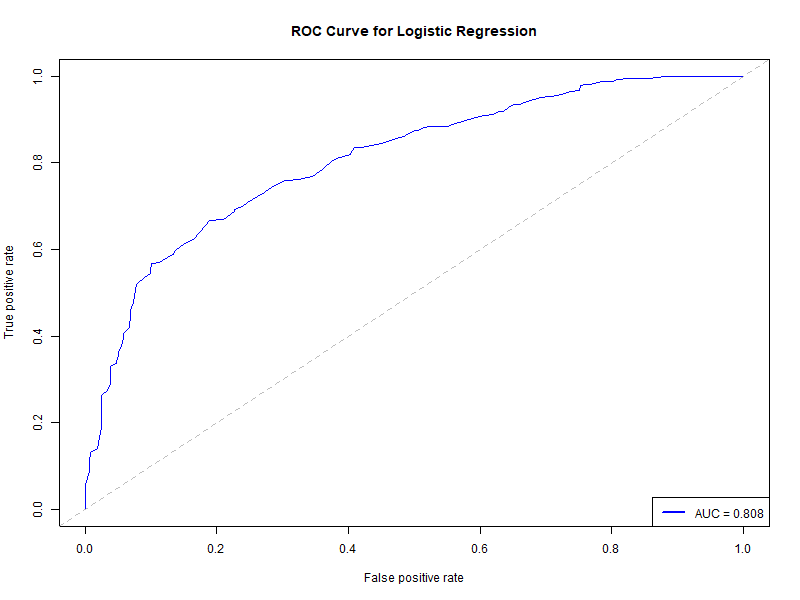

# R Course Final Assignment
## Dataset: 
### A behavioral pretest: testing the stimuli for an a planned fMRI study 
My thesis revolves around neural synchronization in response to political social media posts containing either outgroup derogatory or ingroup favoring content. 

### Participants and stimuli
Our participants will be left- and right-wing supporters. Stimuli are real 'X' (previously 'Twitter') posts, and are divided into 4 stimulus types:
* Right-wing making pro-right claims.
* Right-wing making anti-left claims.
* Left-wing making pro-left claims.
* Left-wing making anti-right claims.
As we already performed one pretest to choose the 18-posts that create the largest left-right support difference, this pretest contained 18 stimuli of each type. Each post was visually apparent and read-aloud by the same male speaker.

### Procedure
The data was collected online via Qualtrics and originally contained 29 responses.
Participants were asked to watch each stimulus, presented in batches by stimulus type, and to rate their level of support in the post and their perceived extremism level of it on a 1 to 7 Likert scale.
At the end, participants were asked to answer a political attitudes questionnaire, containing 4 visual analog scales (values were not visible to respondents):
* Political involvement
* Political wing affiliation - from right (0) to left (100)
* Coalition (0) or opposition (100) support level
* Governmental support in recent years - from Netanyahu (0) to Benet-Lapid (100)
* Free text - partisan affiliation. 
Participants were also asked to fill in a demographic questionnaire at the end containing age, gender, education level and mother tongue. 

### The pretest aim is twofold:
1. Manipulation check for the read-aloud stimuli - as we want to stimulate different support-related neural reactions in future participants, we expected differences in support ratings between participants who are right and left wing affiliated. The previous pretest has revealed the expected differences, and now we want to ensure these differences will be replicated for the read-aloud posts.

2. Dependency check of support and extremism ratings - to understand if the different support reactions derive, or connected to, the level of perceived extremism of a presented post. The previous pretest has revealed a linear relationship between the two, and now we plan on exploring this relationship using another statistical method.

## The Research questions:
1. Will political wing affiliation predict participants' support ratings of different types of posts?
2. Is there a relationship between supporting a political post and perceiving it as extreme?

# Preproccessing
1. Preproccessing of the data includes first a transition from collected to raw data. The following figures present descriptives of the raw data before filtering ourliers:

  
   

  
  

  
2. Preprocessing from raw to filtered data, filtering outliers and unnecessary variables (n (outliers) = 3).  
# Statistical analyses
## Descriptive statistics
Summarizing participants mean age (and SD) after filtering by gender and political affiliation.
## Linear regression
### Predicting support ratings of posts by the interaction between political affiliation (continuous) and post type
The linear mixed model assessed whether support ratings differed across stimulus types (post types), while also considering participants’ political alignment (raw score). As this is a within-subject design, subjects identity was treated as a random effect. This served as a manipulation check to verify whether left and right-wing participants responded to the stimuli in the expected direction.

The model revealed the expected interaction between political alignment and stimulus type, indicating that individuals' support ratings varied depending on both their political orientation and the nature of the stimulus. 

•	Pro-left × Political Alignment (β = 0.0618)
As political affiliation score increases (more left-wing), support for pro-left stimuli increases.

•	Anti-right × Political Alignment (β = 0.0574)
As political affiliation score increases (more left-wing), support for anti-right stimuli increases.

•	Anti-left × Political Alignment (β = -0.0068)
As political affiliation score (more left-wing), support for anti-left stimuli slightly decreases.

Thus, interaction effects show that political alignment meaningfully influenced how participants responded to different post types, confirming that the stimuli effectively captured ideological differences (unstandardized slopes values are small due to the small scale range for support in comparison to the large scale range for political affiliation to camp). Left-wing participants (higher political affiliation score) gave higher support for pro-left and anti-right content, while rejecting anti-left content.Right-wing participants (lower political affiliation score) opposed pro-left and anti-right content, while supporting anti-left content.

## Logistic regression
### Predicting extremicy labeling of posts by support ratings
Mixed logistic regression was used to measure the ability to predict extremicy labeling of posts by the level of support in it. Again, subjects' identity was treated as a random effect. To use a logistic model, we used median values of extreme ratings to divide perceived extremism for each post to either extreme or not extreme.
The results showed that higher support ratings were significantly associated with a decreased probability of an extreme response (β = -0.478, p < 0.001), suggesting that moderate support levels were less likely to produce extreme reactions. 
We found a negative coefficient for support (β = -0.478, p = 2e-16), indicating an inverse relationship with extreme responses (AUC = .
•  Specifically, for each one-unit increase in support, the odds of an extreme response decrease by 38% (1 - 0.62 = 0.38).
•  In other words, higher support levels are associated with a lower likelihood of extreme responses.

