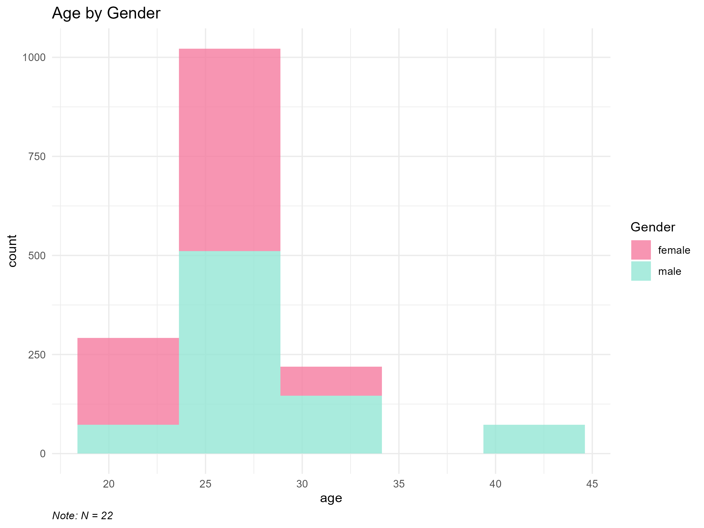
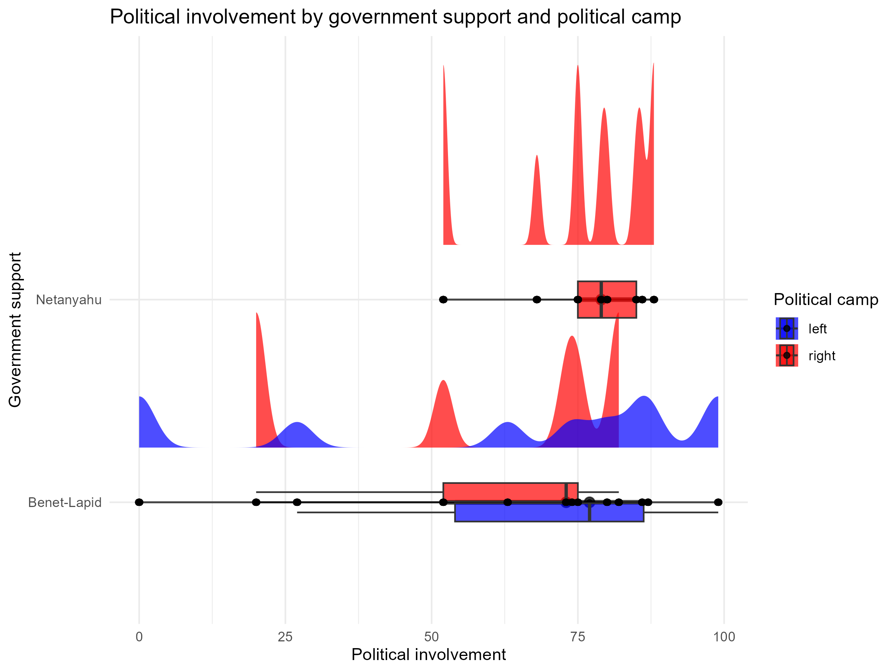
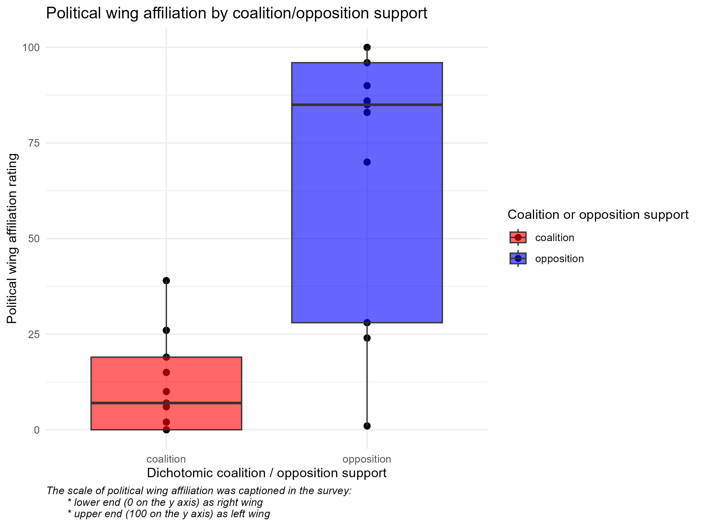

# R Course Final Assignment
## Dataset: 
### A behavioral pretest for the stimuli in an fMRI I am conducting as my thesis.
My thesis revolves around neural synchronization in response to political social media posts containing either outgroup derogating or ingroup appealing content. Our participants will be left and right wing-supporters, thus the 'X' (previously 'Twitter') posts are devided into 4 stimuli types:
* Right wing making pro-right claims.
* Right wing making anti-left claims.
* Left wing making pro-left claims.
* Left wing making anti-right claims.
As we already performed one pretest to choose the 18-posts that create the largest support difference between left-right supporters, this pretest contained 18 stimuli of each type, each was visually apperant and also read-aloud by the same male speaker.
The data was collected online via Qualtrics and originally contained 29 resposes.
Participants were asked to watch each stimuli, presented in batches by stimulus type, and to rate their level of support in the post and their percieved extremism level of it on a 1 to 7 Likert scale.
At the end, participants were asked to answer a political attitudes questionnaire, containing 4 visual analoge scales (values were not visible to respondents):
* Political involvement
* Political wing affiliation - from right (0) to left (100)
* Coalition (0) or opposition (100) support level
* Governmental support in recent years - from Netanyahu (0) to Benet-Lapid (100)
* Free text - partisan affiliation. 
Participants were also asked to fill a demographic questionnaire at the end containing age, gender, education level and mother tounghe. 
### The pretest aim is twofold:
1. Manipulation check for the stimuli - as we want to stimulate different support neural reactions in future participants, we expected major differences in support between participants who are right and left wing affiliated.
2. Dependency check of support and extremism ratings - to understand if the different support reaction derive, or connected to, the level of percieved extremism of the presented post.
## The Reserch questions:
1. Do different stimuli types arouse different support among left and right-wing affiliated participants?
2. Is there a relationship between supporting posts and percieving the extremism levels of its' content?
# Preproccessing
1. Preproccessing of the data includes first a transition from collected to raw data. The following figures present descriptives of the raw data before filtering ourliers:

  
   

  
  

  
2. Preprocessing from raw to filtered data, filtering outliers and unnecessary variables (n (outliers) = 3).  
# Statistical analyses
## Descriptive statistics
Summarizing participants mean age (and SD) after filtering by gender and political affiliation.
## Linear regression
### Predicting support ratings of posts by the interaction between political affiliation (continuous) and post type
The linear mixed model assessed whether support ratings differed across stimulus types (post types), while also considering participants’ political alignment (raw score). As this is a within-subject design, subjects identity was treated as a random effect. This served as a manipulation check to verify whether left and right-wing participants responded to the stimuli in the expected direction.

The model revealed the expected interaction between political alignment and stimulus type, indicating that individuals' support ratings varied depending on both their political orientation and the nature of the stimulus. 

## Logistic regression
### Predicting extremicy labeling of posts by support ratings
Mixed logistic regression was used to measure the ability to predict extremicy labeling of posts by the level of support in it. Again, subjects' identity was treated as a random effect.
The results ....................

